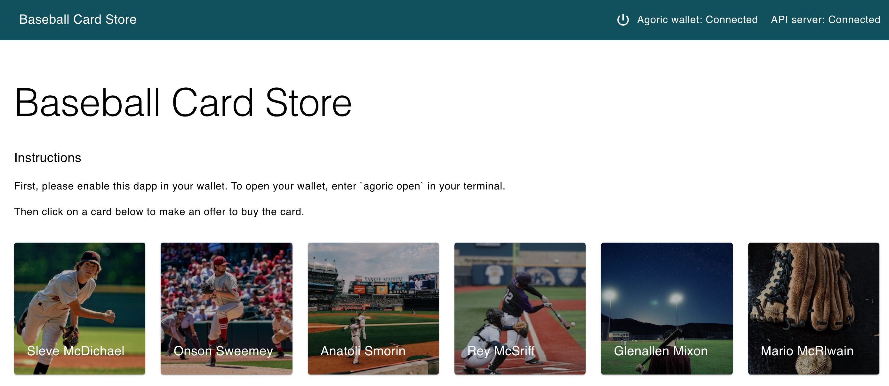

# Baseball Card Store Dapp

TL;DR:

The Baseball Card Store Dapp sells baseball cards as NFT tokens in
exchange for money.

Install the
[prerequisites](https://agoric.com/documentation/getting-started/before-using-agoric.html).

### Execute every command below in a seperate terminal

Install the sdk
```sh
cd agoric-sdk
git checkout 65d3f14c8102993168d2568eed5e6acbcba0c48a
yarn && yarn build
```

Install the dapp
```sh
git clone https://github.com/Jorge-Lopes/agoric-assignment-6.git
cd agoric-assignment-6
agoric install
```

Start your local-chain
```sh
cd agoric-sdk/packages/cosmic-swingset
make scenario2-setup && make scenario2-run-chain
```

Start `ag-solo`
```sh
cd agoric-sdk/packages/cosmic-swingset
make scenario2-run-client
```

Open your wallet UI
```sh
cd agoric-sdk/packages/cosmic-swingset/t1
agoric open --repl
```

Deploy the contract
```sh
cd agoric-assignment-6
agoric deploy contract/deploy.js api/deploy.js
```

Start UI, 
```sh
# Navigate to the `ui` directory and start a local server
cd agoric-assignment-6/ui && yarn start
```

## Using the Dapp

1. A window for your wallet should open.
4. Under "Dapps" in the wallet, enable the CardStore Dapp.
5. Now you should be able to click on a card to make an offer to buy
   it.
6. Approve the offer in your wallet
7. View the card in your wallet.



To learn more about how to build Agoric Dapps, please see the [Dapp Guide](https://agoric.com/documentation/dapps/).

See the [Dapp Deployment Guide](https://github.com/Agoric/agoric-sdk/wiki/Dapp-Deployment-Guide) for how to deploy this Dapp on a public website, such as https://cardstore.testnet.agoric.com/
