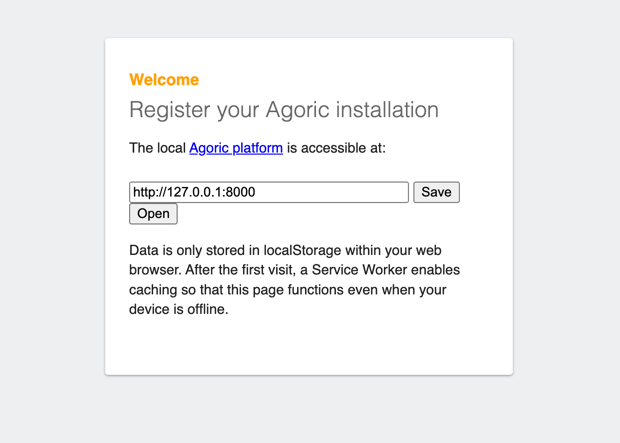
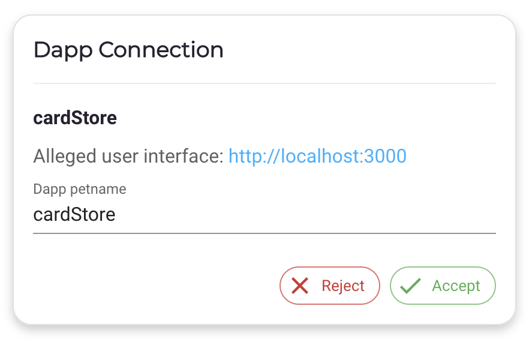
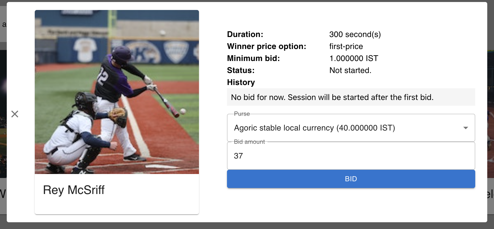
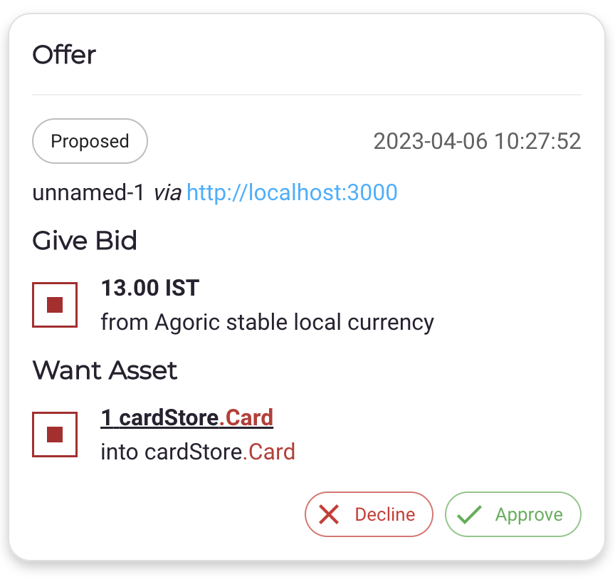
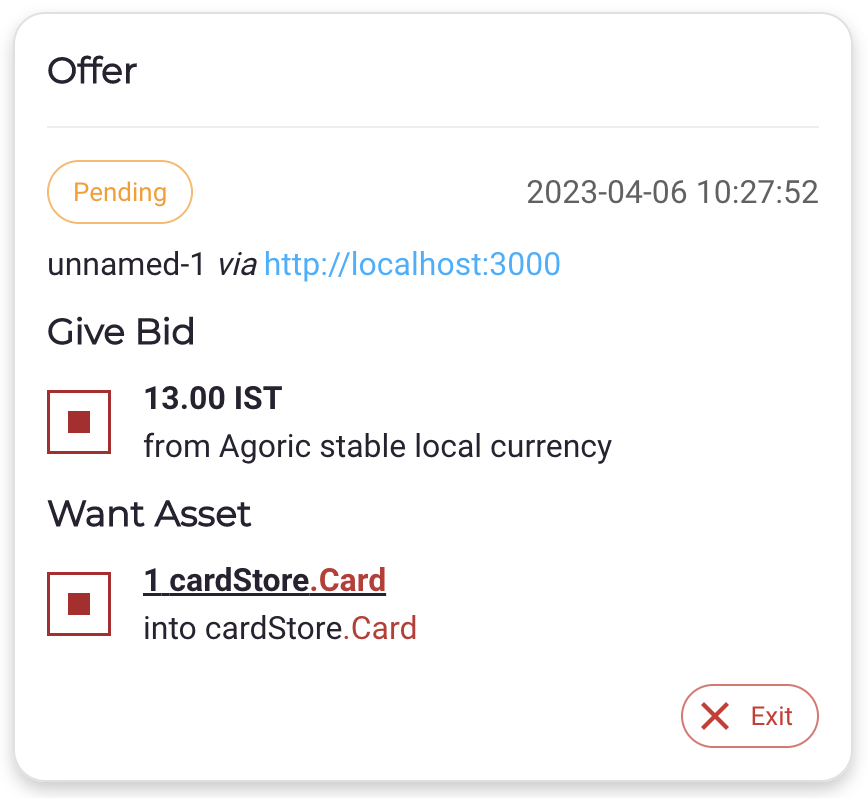
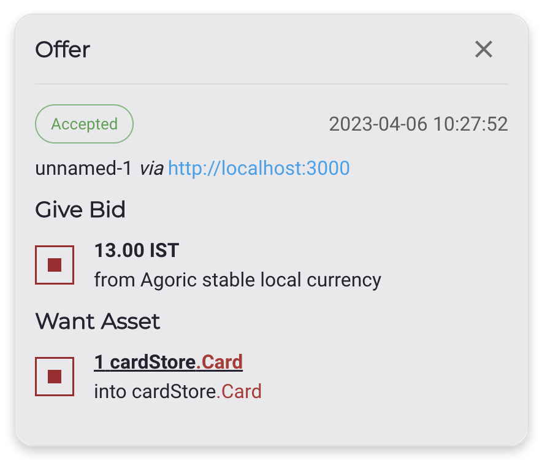

# Baseball Card Store Dapp

The Baseball Card Store Dapp sells baseball cards as NFT tokens in exchange for tokens.

## Creating a new Dapp project

```sh
cd $HOME
# Install the dapp into a directory named demo
npm create @agoric/dapp -- --dapp-template dapp-card-store --dapp-branch mfig-hack-getting-started demo
# Use the new dapp's directory
cd demo
# Install the project dependencies
yarn install
```

## Initializing the Dapp

1. Open a new tab from your browser, go to https://wallet.agoric.app/locator/ and enter http://localhost:8000/ into the
   dialog as shown below.
   <br/>

2. Start the Agoric VM: it will open the Dapp and wallet UIs when ready.
```sh
yarn start
```

## Using the Dapp

1. Navigate to the Dapp UI at http://localhost:3000

2. The dapp will ask you to switch to the Agoric Wallet tab to `Accept` the `Dapp Connection`.
   If the wallet is not open, you can run `yarn start:wallet` to interact with it.

3. In the wallet, `Accept` the `Dapp Connection` between cardStore and the wallet.

   <br/>

4. In the dapp, you should be able to click on a baseball card to `BID` on it in an action. Enter `Bid ammount` to submit an offer to buy the card.

   <br/>

5. In the wallet, `Approve` the `Proposed` offer to bid on a card.

   <br/>

6. In the wallet, the offer will be in a `Pending` state while the auction for the card to complete. The auction takes up to 300 seconds.

   <br/>

7. In the wallet, your offer will transition to an `Accepted` state when the auction ends. Your `cardStore.Card` purse will now contain a card

   <br/>

To learn more about how to build Agoric Dapps, please see the [Dapp Guide](https://agoric.com/documentation/dapps/).
