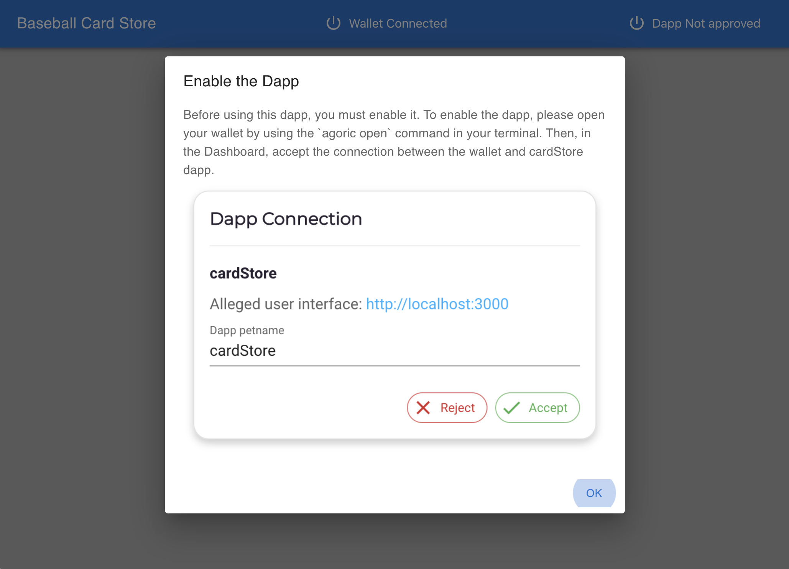

# Baseball Card Store Dapp

The Baseball Card Store Dapp sells baseball cards as NFT tokens in exchange for tokens.

## Run the Dapp

To run the dapp, you'll use 3 separate terminal windows

### Initialize the Agoric VM

```sh
# Terminal 1
cd $HOME
# Install the dapp into a directory named demo
npx agoric@latest init --dapp-template dapp-card-store --dapp-branch mhofman/npm-latest demo
# Use the new dapp's directory
cd demo
# Install the project dependencies
yarn install
# Start the Agoric simulated blockchain & VM.
# This will take a few minutes to complete. Wait for the output to settle.
yarn start:chain --reset --verbose
```

### Open the Agoric Wallet and REPL UI

```sh
# Terminal 2
# Use the demo directory
cd $HOME/demo
# Open the Agoric solo wallet and repl
# This should open a new browser tab to http://127.0.0.1:8000
yarn agoric open --repl
```

### Deploy the Contract and API

```sh
# Terminal 2
# Use the demo directory
cd $HOME/demo
# Deploy a new instance of the contract to the VM
yarn agoric deploy ./contract/deploy.js
# Deploy a new instance of the API to the VM
yarn agoric deploy ./api/deploy.js
```

### Start the Dapp UI

```sh
# Terminal 3
# Use the demo directory
cd $HOME/demo
# Start the user interface
yarn start:ui
```

## Using the Dapp

1. `yarn agoric open` will have opened your wallet at http://127.0.0.1:8000/

2. `yarn start:ui` will open the dapp at http://127.0.0.1:3000. The dapp will ask you to switch to the wallet to `Accept` the `Dapp Connection`.

   <br/>

3. Open a new tab from your and go to https://wallet.agoric.app/locator/ and enter http://127.0.0.1:8000/ into the
   dialog as shown below.
   <br/>

4. In the wallet, `Accept` the `Dapp Connection` between cardStore and the wallet.

   <br/>

5. In the dapp, you should be able to click on a baseball card to `BID` on it in an action. Enter `Bid ammount` to submit an offer to buy the card.

   <br/>

6. In the wallet, `Approve` the `Proposed` offer to bid on a card.

   <br/>

7. In the wallet, the offer will be in a `Pending` state while the auction for the card to complete. The auction takes up to 300 seconds.

   <br/>

8. In the wallet, your offer will transition to an `Accepted` state when the auction ends. Your `cardStore.Card` purse will now contain a card

   <br/>

To learn more about how to build Agoric Dapps, please see the [Dapp Guide](https://agoric.com/documentation/dapps/).
